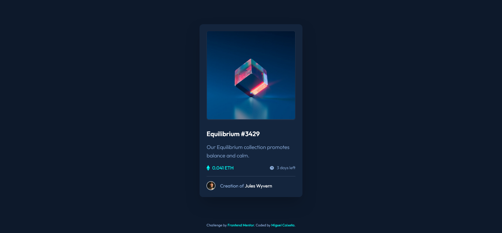
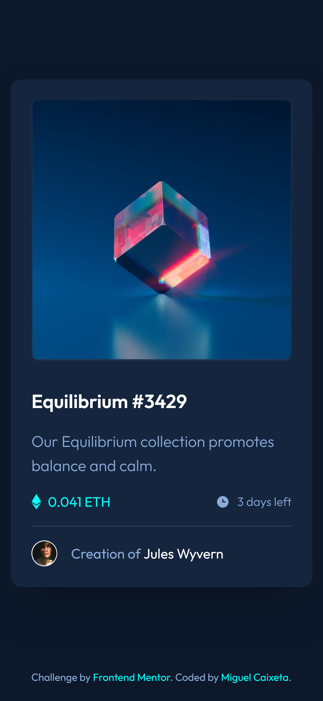

# Frontend Mentor - NFT preview card component solution

This is a solution to the [NFT preview card component challenge on Frontend Mentor](https://www.frontendmentor.io/challenges/nft-preview-card-component-SbdUL_w0U). Frontend Mentor challenges help you improve your coding skills by building realistic projects.

## Table of contents

- [Overview](#overview)
  - [The challenge](#the-challenge)
- [Built with](#built-with)
- [Screenshot](#screenshot)
- [Links](#links)
- [Author](#author)

## Overview

### The challenge

Users should be able to:

- View the optimal layout depending on their device's screen size
- See hover states for interactive elements

## Built with

<ul>
  <li>HTML</li>
  <li>CSS</li>
  <li>Vite</li>
  <li>React</li>
  <li>Tailwind CSS</li>
</ul>

## Screenshot

### Desktop

### Mobile

  

## Links

- Solution URL: [GitHub](https://github.com/MiguellPC/nft-preview-card)
- Live Site URL: [GitHub Pages](https://miguellpc.github.io/nft-preview-card/)

## Author

- GitHub - [Miguel Caixeta](https://github.com/MiguellPC)
- Frontend Mentor - [@MiguellPC](https://www.frontendmentor.io/profile/MiguellPC)
- Linkedin - [Miguel Caixeta](https://www.linkedin.com/in/miguel-caixeta-39628a118/)
